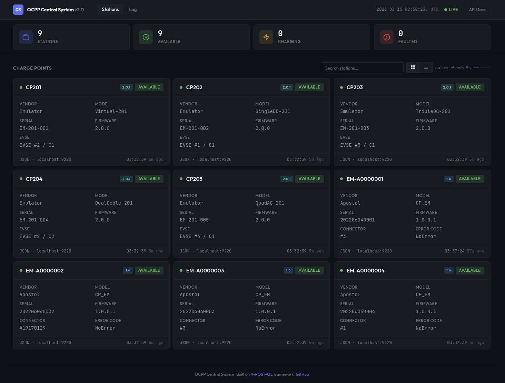

[](README.ru-RU.md)
[](https://github.com/apostoldevel/ocpp-cs/releases/latest)
[](LICENSE)

<p align="center">
  
</p>

# OCPP Central System

**Central system and charge point emulator for OCPP 1.5 (SOAP), 1.6 and 2.0.1 (JSON/WebSocket) in C++20.**

Built on [A-POST-OL](https://github.com/apostoldevel/libapostol) — a high-performance C++20 framework with a single `epoll` event loop for HTTP, WebSocket, and PostgreSQL.

## Quick Start

**One command:**
```shell
curl -fsSL https://raw.githubusercontent.com/apostoldevel/ocpp-cs/master/install.sh | bash
```

Or manually:
```shell
git clone --recursive https://github.com/apostoldevel/ocpp-cs.git
cd ocpp-cs
docker compose up
```

Open in your browser:
- **http://localhost:9220** — Web UI (no login required)
- **http://localhost:9220/docs/** — Swagger UI (REST API)

**Connect your charging station** — set the Central System URL in your station's configuration:
```
ws://YOUR_SERVER_IP:9220/ocpp/YOUR_STATION_ID
```
The station will appear in the Web UI automatically after it connects. The protocol version (1.6 or 2.0.1) is determined by the `Sec-WebSocket-Protocol` header sent by the station.

That's it. The container runs a fully functional Central System with a built-in charge point emulator — no database, no external services, no configuration needed.

## What You Get

| Feature | Details |
|---------|---------|
| Central System | OCPP 1.5 (SOAP/HTTP), 1.6 and 2.0.1 (JSON/WebSocket) |
| Schema Validation | All incoming messages validated against official OCPP JSON Schemas |
| Charge Point Emulator | Built-in OCPP 1.6 and 2.0.1 stations, auto-connect on startup |
| Web UI | Dashboard, station management, OCPP commands, live message log |
| REST API | OpenAPI spec + Swagger UI at `/docs/` |
| One-command install | `curl \| bash` — Docker setup in 30 seconds |
| Integration | Webhook or PostgreSQL — your choice |

## OCPP 2.0.1 Support

The Central System supports 22 OCPP 2.0.1 messages — full charging session lifecycle, device management, provisioning, and availability:

| Direction | Messages |
|-----------|----------|
| CP → CSMS (9) | BootNotification, Heartbeat, StatusNotification, Authorize, TransactionEvent, MeterValues, NotifyReport, FirmwareStatusNotification, DataTransfer |
| CSMS → CP (12) | RequestStartTransaction, RequestStopTransaction, Reset, SetVariables, GetVariables, ChangeAvailability, UnlockConnector, TriggerMessage, ClearCache, GetBaseReport, GetReport, GetTransactionStatus |
| Both (1) | DataTransfer |

Key differences from OCPP 1.6:
- **3-tier model** — Station → EVSE → Connector (instead of flat connector list)
- **TransactionEvent** — single message replaces StartTransaction, StopTransaction, and MeterValues
- **Device Model** — SetVariables/GetVariables replace ChangeConfiguration/GetConfiguration
- **Schema validation** — all messages validated against official OCPP 2.0.1 JSON Schemas
- **Spec-compliant details** — correct triggerReason→stoppedReason mapping, connectorId validation, remoteStartId tracking, scheduled availability changes

The built-in emulator includes 5 OCPP 2.0.1 stations with different configurations:

| Station | Model | EVSEs | Connectors |
|---------|-------|-------|------------|
| CP201 | Virtual-201 | 2 | CCS2, CCS1 |
| CP202 | SingleDC-201 | 1 | CCS1 |
| CP203 | TripleDC-201 | 3 | CCS2, CCS1, ChaoJi |
| CP204 | DualCable-201 | 2 | 2 per EVSE (CCS2+CCS1, CCS2+ChaoJi) |
| CP205 | QuadAC-201 | 4 | Type2, Type2, Type1, Type1 |

## Live Demo

Connect your charge point to the demo server:

| Protocol | Address |
|----------|---------|
| WebSocket (OCPP 1.6) | `ws://ws.ocpp-css.com/ocpp` |
| SOAP (OCPP 1.5) | `http://soap.ocpp-css.com/Ocpp` |

Web UI: [http://cs.ocpp-css.com](http://cs.ocpp-css.com) (login: `demo` / `demo`, RFID: `demo`)

## Docker

### Quick Run (Docker Hub)

```shell
docker pull apostoldevel/cs
docker run -p 9220:9220 --rm --name cs apostoldevel/cs
```

### Build & Run Locally

```shell
git clone --recursive https://github.com/apostoldevel/ocpp-cs.git && cd ocpp-cs
docker compose up
```

### Environment Variables

| Variable | Description |
|----------|-------------|
| `WEBHOOK_URL` | Webhook endpoint URL (enables webhook mode) |
| `WEBHOOK_AUTH` | Auth scheme: `Basic`, `Bearer`, or `Off` (default) |
| `WEBHOOK_USERNAME` | Username for Basic auth |
| `WEBHOOK_PASSWORD` | Password for Basic auth |
| `WEBHOOK_TOKEN` | Token for Bearer auth |

Example with webhook:
```shell
docker run -p 9220:9220 --rm --name cs \
  -e WEBHOOK_URL=http://your-server/api/v1/ocpp/parse \
  -e WEBHOOK_AUTH=Basic \
  -e WEBHOOK_USERNAME=ocpp \
  -e WEBHOOK_PASSWORD=ocpp \
  apostoldevel/cs
```

### Custom Configuration

Before building, you can edit:

| File | Purpose |
|------|---------|
| `docker/conf/default.json` | Server settings, webhook endpoint |
| `docker/www/config.js` | Web UI server address |
| `docker/conf/sites/default.json` | Allowed hostnames |

Example `sites/default.json` for your server:
```json
{
  "hosts": ["cs.example.com", "cs.example.com:9220", "192.168.1.100:9220", "localhost:9220"]
}
```

## Build from Source

### Prerequisites

- **C++20** compiler: GCC 12+ or Clang 16+
- **CMake** 3.25+
- `libssl-dev`, `zlib1g-dev`
- `libpq-dev` (optional, only with `WITH_POSTGRESQL`)

```shell
sudo apt-get install build-essential libssl-dev zlib1g-dev make cmake gcc g++
```

### Build

```shell
git clone --recursive https://github.com/apostoldevel/ocpp-cs.git && cd ocpp-cs

./configure               # release build
cmake --build cmake-build-release --parallel $(nproc)
sudo cmake --install cmake-build-release
```

### Local Development

```shell
./configure --debug
cmake --build cmake-build-debug --parallel $(nproc)
mkdir -p logs
./cmake-build-debug/cs -p . -c conf/default.json
```

### CMake Options

| Option | Default | Description |
|--------|---------|-------------|
| `INSTALL_AS_ROOT` | ON | Install to system dirs (`/usr/sbin/`, `/etc/cs/`) |
| `WITH_POSTGRESQL` | ON | PostgreSQL integration. Disable for standalone mode |
| `WITH_SSL` | ON | TLS, JWT, OAuth 2.0 |

Standalone build (no database):
```shell
./configure --release --without-postgresql --without-ssl
```

## Integration

### Webhook

The simplest integration method. Configure in `conf/default.json`:

```json
{
  "webhook": {
    "enable": true,
    "url": "http://your-server/api/v1/ocpp/parse",
    "authorization": "Basic",
    "username": "ocpp",
    "password": "ocpp"
  }
}
```

The Central System forwards all charge point-initiated messages (Authorize, BootNotification, StartTransaction, StopTransaction, TransactionEvent, etc.) to your endpoint as JSON:

```json
{
  "identity": "EM-A0000001",
  "uniqueId": "25cf07c9ae20a0566d1043587b5790a6",
  "action": "BootNotification",
  "payload": {
    "firmwareVersion": "1.0.0.1",
    "chargePointModel": "CP_EM",
    "chargePointVendor": "Apostol",
    "chargePointSerialNumber": "202206040001"
  },
  "account": "AC0001"
}
```

Your server responds in the same format with the OCPP-compliant `payload`:

```json
{
  "identity": "EM-A0000001",
  "uniqueId": "25cf07c9ae20a0566d1043587b5790a6",
  "action": "BootNotification",
  "payload": {
    "status": "Accepted",
    "interval": 600,
    "currentTime": "2024-10-22T23:08:58.205Z"
  }
}
```

**Fields:**
- `identity` — charge point identifier
- `uniqueId` — request ID
- `action` — OCPP action name
- `payload` — OCPP data
- `account` — optional user account (extracted from the connection URL: `ws://host/ocpp/EM-A0000001/AC0001`)

### PostgreSQL

For direct database integration, create the `ocpp` schema with these functions:

**Core:**
- `ocpp.Parse(pIdentity, pUniqueId, pAction, pPayload, pAccount, pVersion)` — unified dispatcher for 1.6 and 2.0.1
- `ocpp.ParseXML` — SOAP 1.5 message parser
- `ocpp.ChargePointList`, `ocpp.TransactionList`, `ocpp.ReservationList`
- `ocpp.JSONToSOAP`, `ocpp.SOAPToJSON`

**OCPP 2.0.1 (called from `ocpp.Parse` when `pVersion = '2.0.1'`):**
- `ocpp.BootNotification201` — registers station with `ocpp_version`
- `ocpp.Authorize201` — nested `idToken.idToken` extraction
- `ocpp.StatusNotification201` — with `evse_id`, `connector_status`
- `ocpp.TransactionEvent` — Started/Updated/Ended via single function
- `ocpp.MeterValues201` — with `evse_id`
- `ocpp.NotifyReport` — device model report logging

The Central System calls these functions during charge point communication, passing data in JSON format. All business logic is implemented in PL/pgSQL. The `pVersion` parameter (default `'1.6'`) enables version-specific handling within `ocpp.Parse`.

## Charge Point Emulator

The built-in emulator creates virtual charge points for development and testing.

Emulator configs are in `conf/cp/` — each subfolder contains a `configuration.json` for one emulated station.

### OCPP 1.6 Stations

Default configs create 4 stations (`CP1`–`CP4`) with flat connector lists. Configuration uses `ConnectorIds` array.

### OCPP 2.0.1 Stations

The `CP201` station demonstrates the 3-tier model with EVSEs and connectors:

```json
{
  "OcppVersion": "2.0.1",
  "ChargePointVendor": "Emulator",
  "ChargePointModel": "Virtual-201",
  "Evses": [
    {"evseId": 1, "connectors": [{"connectorId": 1, "type": "cCCS2"}]},
    {"evseId": 2, "connectors": [{"connectorId": 1, "type": "cCCS1"}]}
  ]
}
```

Set `"OcppVersion": "2.0.1"` to use the OCPP 2.0.1 protocol. If absent, defaults to `"1.6"`.

### Configuration

Enable in `conf/default.json`:
```json
{
  "module": {
    "ChargePoint": {"enable": true}
  }
}
```

Emulator-only mode (disable Central System):
```json
{
  "process": {
    "master": false
  }
}
```

## Service Management

```shell
sudo systemctl start  cs
sudo systemctl stop   cs
sudo systemctl status cs
```

### Signals

| Signal | Action |
|--------|--------|
| TERM, INT | fast shutdown |
| QUIT | graceful shutdown |
| HUP | reload configuration, start new workers |
| WINCH | graceful worker shutdown |
